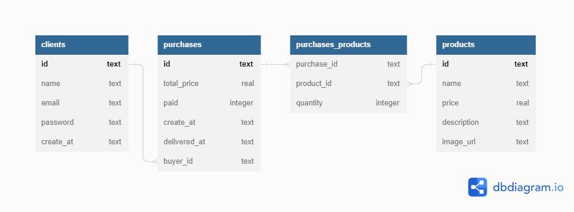

# Projeto Labecommerce - BackEnd



## Introdução

O projeto 'Labecommerce' consiste na criação de uma API Rest para um e-commerce utilizando um banco de dados em SQL, com o sistema CRUD integrado para gerenciar o ciclo completo de vendas. Os endspoints permitem a criação de usuários, produtos e pedidos, assim como sua leitura, atualização e exclusão das informações cadastradas.

## Documentação

- Acesse a documentação da API pelo postman: [Clique aqui!](https://documenter.getpostman.com/view/25826545/2s93XyUP1f)

## Sobre o Projeto

### Instalação

```bash
# Instale todas as dependências
$ npm install

# Execute o projeto
$ npm run dev

# A aplicação será iniciada na porta 3003

# Use algum API Client para realizar as requisições
```

### Tecnologias

- NodeJS
- Typescript
- Express
- Knex
- Sqlite3

### Endpoints

- **Users:**
  - Create user
    - Criação de um novo usuário.
  - Get all users
    - Retorna todos os usuários cadastrados.
  - Edit user by id
    - Atualização de uma ou mais informações de um usuário através do seu ID.
  - Delete user by id
    - Exclusão de um usuário cadastrado.
  - **Products:**
    - Create product
      - Criação de um novo produto.
    - Get all products
      - Retorna todos os produtos cadastrados.
    - Get product by name
      - Pesquisa por produtos através de seu nome ou parte dele.
    - Get products by id
      - Retorna as informações de um produto por seu ID.
    - Edit product by id
      - Atualização de uma ou mais informações de um produto através do seu ID.
    - Delete product by id
      - Exclusão de um produto cadastrado.
  - **Purchases:**
    - Create purchase
      - Criação de um novo pedido.
    - Get all purchases
      - Retorna todos os pedidos cadastrados.
    - Get purchase by id
      - Retorna as informações de um pedido por seu ID, incluindo a lista de produtos e os dados do usuário.
    - Get purchases by user id
      - Retorna retorna todos os pedidos realizado por um usuário através do seu ID.
    - Delete purchase by id
      - Exclusão de um pedido realizado.

## Contato

E-mail: suuzanemoura@gmail.com

[](https://www.linkedin.com/in/suuzanemoura/)
